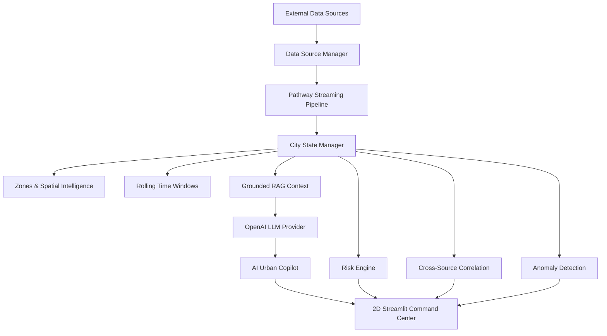

# Real-Time Urban Intelligence & AI Copilot

An end-to-end real-time urban intelligence platform and Human-in-the-Loop AI Copilot featuring Pathway-based real-time streaming with grounded RAG and OpenAI LLM integration.

---

## Overview

The **Real-Time Urban Intelligence Platform** ingests heterogeneous city telemetry (weather, air quality, traffic sensors, police scanner alerts, and HTTP webhooks), streams and processes events through **Pathway**, maintains a real-time **Live City State**, detects temporal anomalies, computes dynamic 0–100 risk scores, correlates events across independent data sources, and provides an evidence-grounded **AI Urban Copilot**.

Operators interact with the system via a modern, professional **2D Streamlit Command Center Dashboard** and an HTTP REST API. The AI Urban Copilot translates natural-language queries into structured analysis, verifiable audit evidence citations, Human-in-the-Loop decision recommendations, and safe client-side dashboard focus actions.

---

## Key Capabilities

- **Real-Time Event Streaming**: High-throughput event ingestion and transformation via Pathway streaming tables (`pw.Table`).
- **Multi-Source Urban Telemetry**: Real-time integration with Open-Meteo Weather API, Open-Meteo Air Quality API, and HTTP webhooks.
- **Webhook Event Ingestion**: Standalone HTTP server (`POST /events`) for external incident payloads.
- **Spatial Zone Intelligence**: Spatial bucketing mapping latitude/longitude coordinates into geographic zones (Zone A Downtown, Zone B Midtown, Zone C Uptown, Zone D Outer District).
- **Rolling Time-Window Analysis**: Sliding aggregations (5m, 15m, 30m, 60m) measuring event velocity and rate-of-change acceleration ratios.
- **Dynamic City Risk Scoring**: Transparent deterministic 0–100 risk score with risk levels (`LOW`, `MODERATE`, `HIGH`, `CRITICAL`) and factor breakdowns.
- **Temporal Anomaly Detection**: Detects frequency acceleration surges (> 2.0x baseline) and critical incident bursts.
- **Cross-Source Event Correlation**: Identifies multi-source incident overlaps (e.g., weather + traffic + webhook collision) in short time windows.
- **Evidence-Grounded RAG**: Dynamically formats up-to-the-second Live City State telemetry into prompt context without manual vector index rebuilds.
- **OpenAI-Powered Urban Copilot**: Grounded query synthesis via OpenAI API with fallback parsing and timeout safety.
- **Deterministic Intent Routing**: Classifies queries into explainable intents (`CITY_SUMMARY`, `RISK_EXPLANATION`, `ZONE_ANALYSIS`, `EVENT_INVESTIGATION`, `EVENT_COMPARISON`, `TIME_WINDOW_ANALYSIS`, `SOURCE_ANALYSIS`, `EVIDENCE_LOOKUP`).
- **Human-in-the-Loop Recommendations**: All AI suggestions are explicitly labeled `[HUMAN REVIEW RECOMMENDATION]`. No autonomous emergency service dispatch or traffic alteration claims.
- **Interactive 2D Command Center Dashboard**: Streamlit interface with 2D map visualization, live event stream, metrics, analytics, anomalies management, AI console, and source health tracking.
- **Multimodal Data Modes**: Configurable via environment variables (`live`, `hybrid`, `simulation`).

---

## Architecture



---

## Technology Stack

| Layer | Technology |
|---|---|
| **Streaming Pipeline** | Pathway |
| **Backend** | Python 3.10+ |
| **LLM Inference** | OpenAI API (`gpt-3.5-turbo`) |
| **RAG** | Real-time grounded context assembler |
| **Dashboard** | Streamlit |
| **Data Visualization** | Plotly |
| **Data Sources** | Open-Meteo REST API, Air Quality API, HTTP Webhooks, Simulation |
| **Analytics** | Rolling sliding windows, Anomaly detection UDFs, Risk scoring engine |
| **Testing** | Pytest (31 passing tests) |
| **Configuration** | Environment variables (`python-dotenv`, PyYAML) |

---

## Real-Time Pipeline

Incoming events flow through the system in a continuous streaming sequence:

$$\text{Event} \longrightarrow \text{Pathway Processing} \longrightarrow \text{City State Update} \longrightarrow \text{Risk Recalculation} \longrightarrow \text{Anomaly / Correlation Analysis} \longrightarrow \text{RAG Context} \longrightarrow \text{Copilot Response} \longrightarrow \text{Dashboard}$$

1. **Ingestion & Normalization**: Data source connectors wrap raw payloads into unified `CityEvent` schemas.
2. **Pathway Graph Execution**: Pathway streaming tables (`pw.Table`) concatenate feeds and evaluate UDFs (`AnomalyDetector.process`) in parallel.
3. **State Aggregation**: `CityStateManager` computes sliding 5m–60m window metrics, spatial zone counts, deterministic risk scores (0–100), and cross-source correlations.
4. **Context Update**: `RAGSystem` formats the latest Live City State and recent event history into structured prompt context.
5. **Copilot Response & UI Rendering**: The AI Urban Copilot generates evidence-grounded analysis, advisory review recommendations, and dashboard focus actions for operator review.

---

## AI Urban Copilot

The AI Urban Copilot supports deterministic intent classification for queries such as:

- **`CITY_SUMMARY`**: *"What is happening right now?"*
- **`RISK_EXPLANATION`**: *"Why is the city risk high?"*
- **`ZONE_ANALYSIS`**: *"Why is Zone A critical?"* / *"Which zone has the highest risk?"*
- **`EVENT_INVESTIGATION`**: *"Show me the incidents responsible for the current risk."* / *"What should an operator investigate first?"*
- **`EVENT_COMPARISON`**: *"Compare Zone A and Zone B."*
- **`TIME_WINDOW_ANALYSIS`**: *"What changed in the last 15 minutes?"*
- **`SOURCE_ANALYSIS`**: *"Is the current situation supported by multiple sources?"*
- **`EVIDENCE_LOOKUP`**: *"Show verified audit evidence citations."*

### Grounding & Human-in-the-Loop Safety

- **Factual Grounding**: The model is instructed to answer strictly using supplied telemetry context. It does not invent incidents or statistics, and explicitly notes if evidence is insufficient.
- **Human-in-the-Loop Boundary**: Recommendations are marked `[HUMAN REVIEW RECOMMENDATION]`. The system is a decision-support tool and **never** autonomously dispatches emergency services, contacts police/ambulance, or alters physical traffic signals.

---

## Real Data Sources

### Weather API
Connects to the **Open-Meteo REST API** to poll real-time temperature, precipitation, and wind speed.

### Air Quality API
Connects to the **Open-Meteo Air Quality API** to monitor AQI, PM2.5, PM10, and particulate anomalies.

### Incident Webhook (`POST /events`)
Standalone HTTP server (`src/webhook_server.py`) on port `8000` for ingesting real-time incident reports and scanner payloads.

### GTFS Transit Interface
Configurable GTFS transit feed interface, active when a GTFS feed URL is specified in configuration.

### Traffic Data
Traffic telemetry is currently configurable/simulated rather than claiming a live commercial traffic API.

---

## Run Locally

### 1. Clone Repository & Setup Virtual Environment
```bash
git clone https://github.com/hariharasuthan1105/pathway-safety-urban-planning.git
cd pathway-safety-urban-planning

# Create and activate Python virtual environment
python -m venv venv
# On Windows:
venv\Scripts\activate
# On Linux/macOS:
source venv/bin/activate

# Install dependencies
pip install -r requirements.txt
```

### 2. Environment Setup
Copy `.env.example` to `.env`:
```bash
cp .env.example .env
```

Edit `.env`:
```ini
DATA_MODE=hybrid
SYSTEM_MODE=public_safety
LOCATION_LAT=40.7128
LOCATION_LON=-74.0060
DASHBOARD_PORT=8501
WEBHOOK_PORT=8000

# Required for real-time OpenAI natural-language synthesis:
OPENAI_API_KEY=your_openai_api_key_here
LLM_MODEL=gpt-3.5-turbo
LLM_TEMPERATURE=0.3
```

*(Note: Automated unit tests use an internal mock LLM provider and do not make external OpenAI API calls).*

### 3. Launch Application & Dashboard

Start main backend pipeline:
```bash
python -m src.main --mode public_safety
```

In a separate terminal, launch the Streamlit Command Center:
```bash
streamlit run src/app/dashboard.py
```
Access the dashboard at `http://localhost:8501`.

---

## Data Modes

Configurable via `DATA_MODE` in `.env`:

- **`simulation`**: Uses synthetic event streams for offline testing and demonstration.
- **`live`**: Queries real external APIs (Open-Meteo Weather & Air Quality) and listens for HTTP webhooks.
- **`hybrid`**: Combines real external feeds with simulation fallbacks for unconfigured sources.

---

## API & Webhooks

The platform exposes two primary HTTP endpoints on port `8000`:

### 1. Ingest Webhook Incident Payload (`POST /events`)
```bash
curl -X POST http://localhost:8000/events \
  -H "Content-Type: application/json" \
  -d '{
    "event_type": "vehicle_collision",
    "severity": "CRITICAL",
    "latitude": 40.7128,
    "longitude": -74.0060,
    "source": "police_scanner",
    "data": {
      "description": "3-vehicle collision blocking two lanes"
    }
  }'
```

### 2. Query AI Urban Copilot (`POST /api/ask`)
```bash
curl -X POST http://localhost:8000/api/ask \
  -H "Content-Type: application/json" \
  -d '{
    "question": "Why is Zone A currently at high risk?"
  }'
```

*(For detailed JSON schemas and example responses, see [`docs/API.md`](docs/API.md)).*

---

## Testing

Run the full automated test suite offline:
```bash
pytest -v
```

### Current Test Result:
```text
============================= 31 passed in 1.79s =============================
```

- All 31 unit tests execute offline in under 2 seconds.
- Unit tests use `MockLLMProvider` and do not make external OpenAI API calls.

### Run Deterministic End-to-End Copilot Demo:
```bash
python scratch/demo_phase6_copilot.py
```

---

## Security

- **Environment Variables**: API keys and secrets are loaded strictly through environment variables.
- **Git Safety**: `.env` is explicitly included in `.gitignore` and is never committed to source control.
- **Template Security**: `.env.example` contains placeholder values only (`your_openai_api_key_here`).
- **Zero Committed Credentials**: No real API keys, passwords, or tokens exist in the source code.

---

## Project Status

**Status: Feature Complete / Demo Ready**

The project provides real-time streaming, grounded RAG context generation, OpenAI LLM integration, deterministic risk scoring, temporal anomaly detection, cross-source correlation, and an interactive 2D Streamlit command center.

### Known Limitations

- **Custom Grounded RAG**: Pathway is used as the streaming telemetry pipeline. RAG context assembly uses a custom real-time grounded context module rather than native `pathway.xpacks.llm` vector stores, ensuring cross-platform support on Windows, Linux, and macOS.
- **Bounding Box Spatial Zones**: Zones use configurable bounding box coordinates (`Zone A` through `Zone D`).
- **60-Minute Streaming Horizon**: Event velocity and acceleration metrics maintain a sliding 60-minute in-memory window.
- **Human-in-the-Loop Boundary**: The AI Copilot provides advisory decision support and cannot autonomously dispatch emergency services or modify physical infrastructure.
- **Traffic Telemetry**: Traffic stream data is simulated/configurable unless an external traffic provider is attached.

---

## 📄 License
MIT License.
